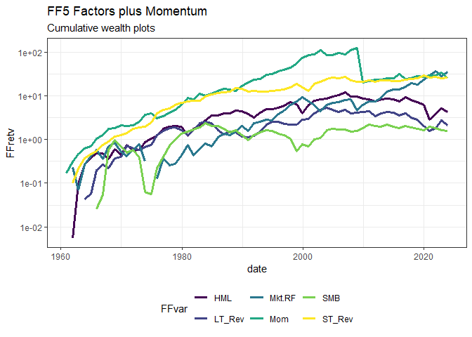

<!-- README.md is generated from README.Rmd. Please edit that file -->

# FFdownload <a href='https://github.com/sstoeckl/FFdownload'></a>

<!-- badges: start -->

[](https://www.repostatus.org/#active)

[](https://cran.r-project.org/package=FFdownload)
[](https://CRAN.R-project.org/package=FFdownload)
[](https://cranlogs.r-pkg.org/badges/grand-total/FFdownload)
[](https://cran.r-project.org/package=FFdownload)
[](https://cran.r-project.org/package=FFdownload)
[](https://lifecycle.r-lib.org/articles/stages.html#stable)
[](https://sstoeckl.github.io/ffdownload/)
<!-- badges: end -->

# `R` Code to download Datasets from [Kenneth French’s famous website](http://mba.tuck.dartmouth.edu/pages/faculty/ken.french/data_library.html).

# Update

Version 1.1.1 corrects a small error for publication on CRAN.

## Motivation

One often needs those datasets for further empirical work and it is a
tedious effort to download the (zipped) csv, open and then manually
separate the contained datasets. This package downloads them
automatically, and converts them to a list of xts-objects that contain
all the information from the csv-files.

## Contributors

Original code from MasimovR <https://github.com/MasimovR/>. Was then
heavily redacted by me.

## Installation

You can install FFdownload from CRAN with

``` r
install.packages("FFdownload")
```

or directly from github with:

``` r
# install.packages("devtools")
devtools::install_github("sstoeckl/FFdownload")
```

## Examples

### Example 0: Easy Access

This is the quick-starter example. It just retrieves the data and
provides it for easy usage!

``` r
library(FFdownload)
library(tidyverse)
FFdownload(inputlist = c("F-F_Research_Data_5_Factors_2x3"), output_file = "FFdata.RData", format = "tbl")
#>   |                                                                              |                                                                      |   0%  |                                                                              |===================================                                   |  50%  |                                                                              |======================================================================| 100%
load("FFdata.RData")
FFdata$`x_F-F_Research_Data_5_Factors_2x3`$monthly$Temp2 |>
  tidyr::pivot_longer(cols = -date, names_to = "FFFactors", values_to = "Value") |> 
  group_by(FFFactors) |> mutate(Price=cumprod(1+Value/100)) |>
  ggplot2::ggplot(aes(x = date, col = FFFactors, y = Price)) + geom_line(lwd=1.2) +
  theme_bw() + theme(legend.position="bottom")
#> Warning: The `trans` argument of `continuous_scale()` is deprecated as of ggplot2 3.5.0.
#> ℹ Please use the `transform` argument instead.
#> This warning is displayed once every 8 hours.
#> Call `lifecycle::last_lifecycle_warnings()` to see where this warning was
#> generated.
```

<!-- -->

### Example 1: Monthly files

In this example, we use `FFDwonload` to

1.  get a list of all available monthly zip-files and save that files as
    *temp.txt*.

``` r
temptxt <- tempfile(fileext = ".txt")
# example_1: Use FFdownload to get a list of all monthly zip-files. Save that list as temptxt.
FFdownload(exclude_daily=TRUE,download=FALSE,download_only=TRUE,listsave=temptxt)
```

``` r
FFlist <- readr::read_csv(temptxt) %>% dplyr::select(2) %>% dplyr::rename(Files=x)
FFlist %>% dplyr::slice(1:3,(dplyr::n()-2):dplyr::n())
#> # A tibble: 6 × 1
#>   Files                                          
#>   <chr>                                          
#> 1 F-F_Research_Data_Factors_CSV.zip              
#> 2 F-F_Research_Data_Factors_weekly_CSV.zip       
#> 3 F-F_Research_Data_Factors_daily_CSV.zip        
#> 4 Emerging_Markets_4_Portfolios_BE-ME_OP_CSV.zip 
#> 5 Emerging_Markets_4_Portfolios_OP_INV_CSV.zip   
#> 6 Emerging_Markets_4_Portfolios_BE-ME_INV_CSV.zip
```

2.  Next, after inspecting the list we specify a vector `inputlist` to
    only download the datasets we actually need.

``` r
tempd <- tempdir()
inputlist <- c("F-F_Research_Data_Factors","F-F_Momentum_Factor","F-F_ST_Reversal_Factor","F-F_LT_Reversal_Factor")
FFdownload(exclude_daily=TRUE,tempd=tempd,download=TRUE,download_only=TRUE,inputlist=inputlist)
```

3.  In the final step we process the downloaded files (formatting the
    output data.frames as tibbles for direct proceeding):

``` r
tempf <- paste0(tempd,"\\FFdata.RData")
getwd()
#> [1] "D:/OneDrive - University of Liechtenstein/ROOT/Packages/ffdownload"
FFdownload(output_file = tempf, exclude_daily=TRUE,tempd=tempd,download=FALSE,
           download_only=FALSE,inputlist = inputlist, format="tbl")
#>   |                                                                              |                                                                      |   0%  |                                                                              |==================                                                    |  25%  |                                                                              |===================================                                   |  50%  |                                                                              |====================================================                  |  75%  |                                                                              |======================================================================| 100%
```

4.  Then we check that everything worked and output a combined file of
    monthly factors (only show first 5 rows).

``` r
library(timetk)
load(file = tempf)
FFdata$`x_F-F_Research_Data_Factors`$monthly$Temp2 %>% 
  left_join(FFdata$`x_F-F_Momentum_Factor`$monthly$Temp2, by="date") %>%
  left_join(FFdata$`x_F-F_LT_Reversal_Factor`$monthly$Temp2,by="date") %>%
  left_join(FFdata$`x_F-F_ST_Reversal_Factor`$monthly$Temp2,by="date") %>% head()
#> # A tibble: 6 × 8
#>   date      Mkt.RF   SMB   HML    RF   Mom LT_Rev ST_Rev
#>   <yearmon>  <dbl> <dbl> <dbl> <dbl> <dbl>  <dbl>  <dbl>
#> 1 Jul 1926    2.96 -2.56 -2.43  0.22    NA     NA  -1.87
#> 2 Aug 1926    2.64 -1.17  3.82  0.25    NA     NA   1.43
#> 3 Sep 1926    0.36 -1.4   0.13  0.23    NA     NA  -0.17
#> 4 Okt 1926   -3.24 -0.09  0.7   0.32    NA     NA  -2.11
#> 5 Nov 1926    2.53 -0.1  -0.51  0.31    NA     NA   1   
#> 6 Dez 1926    2.62 -0.03 -0.05  0.28    NA     NA   2.01
```

5.  No we do the same with annual data:

``` r
FFfive <- FFdata$`x_F-F_Research_Data_Factors`$annual$`annual_factors:_january-december` %>% 
  left_join(FFdata$`x_F-F_Momentum_Factor`$annual$`january-december` ,by="date") %>%
  left_join(FFdata$`x_F-F_LT_Reversal_Factor`$annual$`january-december`,by="date") %>%
  left_join(FFdata$`x_F-F_ST_Reversal_Factor`$annual$`january-december` ,by="date") 
FFfive %>% head()
#> # A tibble: 6 × 8
#>   date      Mkt.RF    SMB    HML    RF   Mom LT_Rev ST_Rev
#>   <yearmon>  <dbl>  <dbl>  <dbl> <dbl> <dbl>  <dbl>  <dbl>
#> 1 Dez 1927   29.5   -2.04  -4.54  3.12  24.1  NA    -17.7 
#> 2 Dez 1928   35.4    4.51  -6.17  3.56  29.1  NA    -10.8 
#> 3 Dez 1929  -19.5  -30.7   11.7   4.75  21.1  NA    -15.0 
#> 4 Dez 1930  -31.2   -5.17 -11.5   2.41  25.7  NA     -0.86
#> 5 Dez 1931  -45.1    3.7  -14.0   1.07  23.8  -3.24  24.2 
#> 6 Dez 1932   -9.39   4.4   11.1   0.96 -21.8   9.27  30.5
```

6.  Finally we plot wealth indices for 6 of these factors:

``` r
FFfive %>% 
  pivot_longer(Mkt.RF:ST_Rev,names_to="FFVar",values_to="FFret") %>% mutate(FFret=FFret/100,date=as.Date(date)) %>% 
  filter(date>="1960-01-01",!FFVar=="RF") %>% group_by(FFVar) %>% arrange(FFVar,date) %>%
  mutate(FFret=ifelse(date=="1960-01-01",1,FFret),FFretv=cumprod(1+FFret)-1) %>% 
  ggplot(aes(x=date,y=FFretv,col=FFVar,type=FFVar)) + geom_line(lwd=1.2) + scale_y_log10() +
  labs(title="FF5 Factors plus Momentum", subtitle="Cumulative wealth plots",ylab="cum. returns") + 
  scale_colour_viridis_d("FFvar") +
  theme_bw() + theme(legend.position="bottom")
#> Warning in transformation$transform(x): NaNs wurden erzeugt
#> Warning in scale_y_log10(): log-10 transformation introduced infinite values.
#> Warning: Removed 11 rows containing missing values or values outside the scale range
#> (`geom_line()`).
```

<!-- -->

# Acknowledgment

I am grateful to **Kenneth French** for providing all this great
research data on his website! Our lives would be so much harder without
this *boost* for productivity. I am also grateful for the kind
conversation with Kenneth with regard to this package: He appreciates my
work on this package giving others easier access to his data sets!
