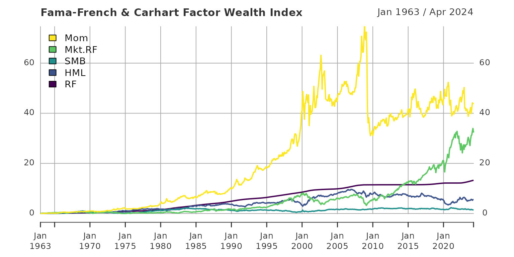

# How-to xts

The following gives an example on how the process of selecting and
retrieving the necessary files for processing is done. We start by
specifying a target directory and target file names. Here, these are
created in a directory that is named based on the download date within a
folder called “data”.

``` r
library(FFdownload)
outd <- paste0("data/",format(Sys.time(), "%F_%H-%M"))
outfile <- paste0(outd,"FFData_xts.RData")
listfile <- paste0(outd,"FFList.txt")
```

Next, we download a list of all available files on [Kenneth French’s
website](https://mba.tuck.dartmouth.edu/pages/faculty/ken.french/data_library.html).
We exclude all daily files to keep the list short.

``` r
FFdownload(exclude_daily=TRUE,download=FALSE,download_only=TRUE,listsave=listfile)
#> Step 1: getting list of all the csv-zip-files!
read.delim(listfile,sep = ",")[c(1:4,73:74),]
#>     X                                        x
#> 1   1        F-F_Research_Data_Factors_CSV.zip
#> 2   2 F-F_Research_Data_Factors_weekly_CSV.zip
#> 3   3  F-F_Research_Data_Factors_daily_CSV.zip
#> 4   4  F-F_Research_Data_5_Factors_2x3_CSV.zip
#> 73 73              F-F_Momentum_Factor_CSV.zip
#> 74 74        F-F_Momentum_Factor_daily_CSV.zip
```

From this list we select the files to download. In our case we use the 3
Fama-French-Factors:

- “F-F_Research_Data_Factors_CSV”
- “F-F_Momentum_Factor_CSV”

and download these files without processing them (for the sake of
showing how the package works).

``` r
inputlist <- c("F-F_Research_Data_Factors_CSV","F-F_Momentum_Factor_CSV")
FFdownload(exclude_daily=TRUE, tempd=outd, download=TRUE, download_only=TRUE, inputlist=inputlist)
#> Step 1: getting list of all the csv-zip-files!
#> Step 2: Downloading 2 zip-files
list.files(outd)
#> [1] "F-F_Momentum_Factor_CSV.zip"       "F-F_Research_Data_Factors_CSV.zip"
```

Now we process these downloaded files and create a final “RData” file
with a certain list structure from it. Due to the separation of the
downloading and processing stage this can be done repeatedly for any
data set saved at a certain point in time in a relevant folder.

``` r
FFdownload(exclude_daily=TRUE, tempd=outd, download=FALSE, download_only=FALSE, inputlist=inputlist, output_file = outfile)
#> Step 1: getting list of all the csv-zip-files!
#> Step 3: Start processing 2 csv-files
#>   |                                                                              |                                                                      |   0%  |                                                                              |===================================                                   |  50%  |                                                                              |======================================================================| 100%
#> Be aware that as of version 1.0.6 the saved object is named FFdata rather than FFdownload to not be confused with the corresponding command!
```

Let us check the structure of the created list (after loading into the
current workspace).

``` r
load(outfile)
ls.str(FFdata)
#> x_F-F_Momentum_Factor : List of 3
#>  $ annual :List of 1
#>  $ monthly:List of 1
#>  $ daily  : Named list()
#> x_F-F_Research_Data_Factors : List of 3
#>  $ annual :List of 1
#>  $ monthly:List of 1
#>  $ daily  : Named list()
```

Now we process the data using code provided to me by [Joshua Ulrich (the
developer of
xts)](https://twitter.com/joshua_ulrich/status/1584950407335321601).
Therein we merge all monthly `xts`-files, select data as off 1963,
divide by $100$ because returns are given in percent, caluclate monthly
returns and finally plot the resulting `xts`.

``` r
monthly <- do.call(merge, lapply(FFdata, function(i) i$monthly$Temp2))
monthly_1960 <- na.omit(monthly)["1963/"]
monthly_returns <- cumprod(1 + monthly_1960/100) - 1
plot(monthly_returns)
```


