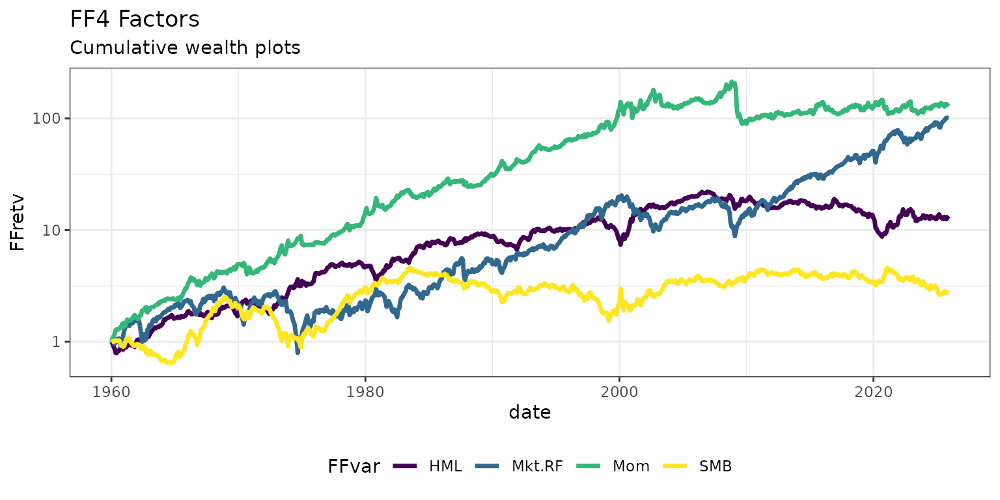

# How-to in the Tidyverse

``` r
library(FFdownload)
library(tidyverse)
outd    <- paste0("data/", format(Sys.time(), "%F_%H-%M"))
outfile <- paste0(outd, "FFData_tbl.RData")
```

This vignette covers the tidyverse workflow. For the step-by-step xts
workflow (with separate download and processing stages), see
[`vignette("FFD-xts-how-to")`](https://sstoeckl.github.io/ffdownload/dev/articles/FFD-xts-how-to.md).

------------------------------------------------------------------------

## Quick start: `FFget()` (new in v1.2.0)

[`FFget()`](https://sstoeckl.github.io/ffdownload/dev/reference/FFget.md)
is the simplest way to get a single dataset into your session. It
returns a tibble directly — no intermediate `.RData` file, no
[`load()`](https://rdrr.io/r/base/load.html) call. Missing-value
sentinels (`-99`, `-999`, `-99.99`) are converted to `NA` by default.

``` r
# Monthly FF 3-factor data as a tibble, NAs handled automatically
ff3 <- FFget("F-F_Research_Data_Factors", subtable = "Temp2")
head(ff3)
#> # A tibble: 6 × 5
#>   date      Mkt.RF   SMB   HML    RF
#>   <yearmon>  <dbl> <dbl> <dbl> <dbl>
#> 1 Jul 1926    2.89 -2.55 -2.39  0.22
#> ...
```

Use `frequency = NULL` to get all frequencies at once, or
`subtable = NULL` to get all sub-tables within a frequency:

``` r
# All sub-tables for the monthly frequency
ff3_monthly <- FFget("F-F_Research_Data_Factors", subtable = NULL)
names(ff3_monthly)   # e.g. "Temp2"

# Annual data as xts
ff3_ann_xts <- FFget("F-F_Research_Data_Factors", frequency = "annual", format = "xts")
```

------------------------------------------------------------------------

## Dataset discovery: `FFlist()` and `FFmatch()`

Before downloading, browse all available datasets and check that your
search strings match the intended files:

``` r
fl <- FFlist()
nrow(fl)         # 100+ non-daily datasets
fl |> filter(grepl("5_Factors|Momentum", name))
```

``` r
FFmatch(c("Research_Data_Factors", "Momentum_Factor"))
#> # A tibble: 2 × 4
#>   requested             matched                    edit_distance similarity
#>   <chr>                 <chr>                              <int>      <dbl>
#> 1 Research_Data_Factors F-F_Research_Data_Factors              3      0.87
#> 2 Momentum_Factor       F-F_Momentum_Factor                    4      0.78
```

------------------------------------------------------------------------

## Bulk download with `FFdownload()` (classic API)

For downloading multiple datasets in one call and/or saving a dated
snapshot for reproducible research, use
[`FFdownload()`](https://sstoeckl.github.io/ffdownload/dev/reference/FFdownload.md)
directly with `format = "tibble"`.

For a detailed explanation of the download / process separation, see
[`vignette("FFD-xts-how-to")`](https://sstoeckl.github.io/ffdownload/dev/articles/FFD-xts-how-to.md).
Here we download and process in one step:

``` r
inputlist <- c("F-F_Research_Data_Factors_CSV","F-F_Momentum_Factor_CSV")
FFdownload(exclude_daily=TRUE, tempd=outd, download=TRUE, download_only=FALSE,
           inputlist=inputlist, output_file=outfile, format="tibble")
#> Step 1: getting list of all the csv-zip-files!
#> Step 2: Downloading 2 zip-files
#> Step 3: Start processing 2 csv-files
#>   |                                                                              |                                                                      |   0%  |                                                                              |===================================                                   |  50%  |                                                                              |======================================================================| 100%
#> Be aware that as of version 1.0.6 the saved object is named FFdata rather than FFdownload to not be confused with the corresponding command!
```

### New parameters

Replace French’s missing-value codes with `NA` during processing:

``` r
FFdownload(exclude_daily=TRUE, tempd=outd, download=TRUE, download_only=FALSE,
           inputlist=inputlist, output_file=outfile, format="tibble",
           na_values=c(-99, -999, -99.99))
```

Return the data list directly in addition to saving the file:

``` r
FFdata <- FFdownload(exclude_daily=TRUE, tempd=outd, download=TRUE,
                     download_only=FALSE, inputlist=inputlist,
                     output_file=outfile, format="tibble",
                     return_data=TRUE)
```

------------------------------------------------------------------------

## Working with the result

``` r
load(outfile)
ls.str(FFdata)
#> x_F-F_Momentum_Factor : List of 3
#>  $ annual :List of 1
#>  $ monthly:List of 1
#>  $ daily  : Named list()
#> x_F-F_Research_Data_Factors : List of 3
#>  $ annual :List of 1
#>  $ monthly:List of 1
#>  $ daily  : Named list()
```

Verify that the sub-tables are tibbles:

``` r
str(FFdata$`x_F-F_Research_Data_Factors`$monthly$Temp2)
#> tibble [1,194 × 5] (S3: tbl_df/tbl/data.frame)
#>  $ date  : 'yearmon' num [1:1194] Jul 1926 Aug 1926 Sep 1926 Oct 1926 ...
#>  $ Mkt.RF: num [1:1194] 2.89 2.64 0.38 -3.27 2.54 2.62 -0.05 4.17 0.14 0.47 ...
#>  $ SMB   : num [1:1194] -2.55 -1.14 -1.36 -0.14 -0.11 -0.07 -0.32 0.07 -1.77 0.39 ...
#>  $ HML   : num [1:1194] -2.39 3.81 0.05 0.82 -0.61 0.06 4.58 2.72 -2.38 0.65 ...
#>  $ RF    : num [1:1194] 0.22 0.25 0.23 0.32 0.31 0.28 0.25 0.26 0.3 0.25 ...
```

Merge the two datasets (the `date` column is a `yearmon` object and
serves as the join key):

``` r
FFfour <- FFdata$`x_F-F_Research_Data_Factors`$monthly$Temp2 %>%
  left_join(FFdata$`x_F-F_Momentum_Factor`$monthly$Temp2, by="date")
FFfour %>% head()
#> # A tibble: 6 × 6
#>   date      Mkt.RF   SMB   HML    RF   Mom
#>   <yearmon>  <dbl> <dbl> <dbl> <dbl> <dbl>
#> 1 Jul 1926    2.89 -2.55 -2.39  0.22    NA
#> 2 Aug 1926    2.64 -1.14  3.81  0.25    NA
#> 3 Sep 1926    0.38 -1.36  0.05  0.23    NA
#> 4 Oct 1926   -3.27 -0.14  0.82  0.32    NA
#> 5 Nov 1926    2.54 -0.11 -0.61  0.31    NA
#> 6 Dec 1926    2.62 -0.07  0.06  0.28    NA
```

Plot cumulative wealth indices using
[`pivot_longer()`](https://tidyr.tidyverse.org/reference/pivot_longer.html)
and `ggplot2`:

``` r
FFfour %>%
  pivot_longer(Mkt.RF:Mom, names_to="FFVar", values_to="FFret") %>%
  mutate(FFret=FFret/100, date=as.Date(date)) %>%
  filter(date>="1960-01-01", !FFVar=="RF") %>%
  group_by(FFVar) %>% arrange(FFVar, date) %>%
  mutate(FFret=ifelse(date=="1960-01-01",1,FFret), FFretv=cumprod(1+FFret)-1) %>%
  ggplot(aes(x=date, y=FFretv, col=FFVar, type=FFVar)) + geom_line(lwd=1.2) +
  scale_y_log10() +
  labs(title="FF4 Factors", subtitle="Cumulative wealth plots", ylab="cum. returns") +
  scale_colour_viridis_d("FFvar") +
  theme_bw() + theme(legend.position="bottom")
#> Ignoring unknown labels:
#> • ylab : "cum. returns"
```


